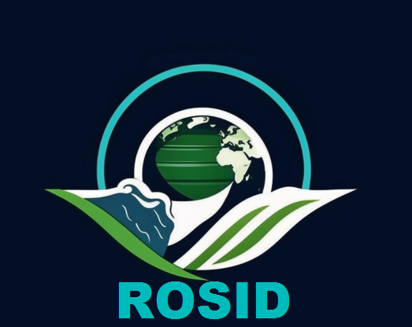

 


## ROSID: Remote Sensing Satellite Data for Oil Spill Detection on Land


The ROSID dataset, designed for detecting onshore oil spills, is based on Landsat satellite imagery. It includes original images with 7 channels and corresponding annotations in GeoTIFF format. 
Additionally, the dataset provides extracted images in RGB format, using channels 7 (SWIR), 4 (NIR), and 3 (Red). 
The dataset is structured similarly to the Cityscapes format and can be downloaded via the provided link and the password is : **P@ssw0rd_ROSID2024$**:

- [ROSID(3 channels)](https://drive.google.com/file/d/1sWJqIoGd_1xaN0oRDz6ceOvcjD9w_EeM/view?usp=sharing)
- [ROSID_SRC(7 channels)](https://drive.google.com/file/d/12h5gklZGlZvcjEnC-y7xSpF_XAQV5Yyb/view?usp=sharing)

Note: The ROSID Dataset can only be used for ***non-commercial*** research purpose. 
For researchers who wants to use the ROSID database, please first fill
in this [Application Form](Application_Form/Application_Form_for_ROSID.docx) 
and send it via email to us ([nurseitovdb@gmail.com](mailto:nurseitovdb@gmail.com)). 

## Description
The dataset used 123 images from the Landsat satellite for the period 2006-2008, with a spatial resolution of 30 meters and a bandwidth of 185 km,
obtained using 7 spectral channels. The dataset contains 9 classes, and the table below presents the list of these classes along with the corresponding number of pixels for each.

| No  | Class name  | Number of Pixels |
| --- | ----------- | ---------------- |
| 1   | oil         | 131 435           |
| 2   | cloud       | 157 338           |
| 3   | shadow      | 74 016            |
| 4   | water       | 18 767            |
| 5   | urban       | 4 020             |
| 6   | soil        | 4 739 347         |
| 7   | vegetation  | 2 775             |
| 8   | look-alike  | 3 731             |
| 9   | background  | 7 720 389         |


The following are some sample of ROSID dataset(RGB):


# ROSID Train
The ```segmentation``` folder contains files for training and testing the ROCID dataset for semantic segmentation.

We used the  [MMSegmentation](https://github.com/open-mmlab/mmsegmentation)  to train the model.

**Step 0.** Download and install Miniconda from the [official website](https://docs.conda.io/en/latest/miniconda.html).

**Step 1.** To train a model on our dataset, you need to install mmsegmentation, here you will find the [installation instructions](https://github.com/open-mmlab/mmsegmentation/blob/master/docs/en/get_started.md). 

**Step 2.** Open the mmsegmentation folder and distribute the files in our repository into folders. 

## Preprocessing
**Step 3.** Divide the dataset into 320x320 pixel fragments with a 106-pixel overlap, and split it into training, validation, and testing sets.
```shell
python create_data_320_320.py
```

**Step 4.** Сhange the dataset path in the file ```configs/_base_/datasets/oil_spill_320_320.py``` on your way which you will receive as a result of previous step. 

## Train
```shell
python tools/train.py configs/mask2former/mask2former_r50_8xb2-90k_cityscapes-512x1024.py
```

## Test
```shell
python tools/test.py configs/mask2former/mask2former_r50_8xb2-90k_cityscapes-512x1024.py work_dirs\mask2former_r50_8xb2-90k_cityscapes-512x1024\iter_40000.pth
```


## Citation and Contact
Please consider to cite our papers when you use our dataset:
```
@Article{es1348, 
author="Nurseitov, Daniyar B. and Abdimanap, Galymzhan and Abdallah, Abdelrahman and Sagatdinova, Gulshat and Balakay, Larissa and Dedova, Tatyana and Rametov, Nurkuisa and Alimova, Anel", 
title="ROSID: Remote Sensing Satellite Data for Oil Spill Detection on Land", 
journal="Engineered Science", 
year="2024", 
volume="32", 
pages="1348", 
abstract="Oil spills on land pose significant environmental hazards, impacting ecosystems and human health. Effective detection and monitoring of these spills are critical for timely response efforts. This paper presents for the first time a ground truth dataset for onshore oil spill detection developed using Landsat imagery. The ground truth was implemented using aerial data. To demonstrate the utility of this dataset, we evaluated several state-of-the-art deep learning models, including DeepLabV3+, UNet, PSP-Net, DeepLabV3 and Mask2Former. Our experiments revealed significant insights into the models&rsquo; capabilities and limitations. Mask2Former and DeepLabV3+, in particular, showed the highest performance metrics. On the validation data, Mask2Former achieved an intersection over Union (IoU) of 72.69% and a F-score coefficient of 84.18%, while DeepLabV3+ achieved an IoU of 67.6% and a F-score coefficient of 80.67%. These results demonstrate the effectiveness of our dataset as a crucial tool for enhancing oil spill detection methodologies and advancing the application of artificial intelligence in ecological preservation and disaster management.", 
issn="2576-9898", 
doi="10.30919/es1348", 
url="http://dx.doi.org/10.30919/es1348" 
}
```


For any quetions about the dataset please contact the authors by sending email to Prof. Daniyar Nurseitov
([nurseitovdb@gmail.com](mailto:nurseitovdb@gmail.com))

