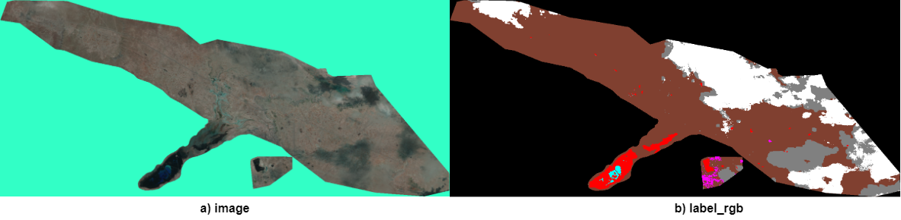

# ROSID: Remote Sensing Satellite Data for Oil Spill Detection on Land

The ROSID dataset, designed for detecting onshore oil spills, is based on Landsat satellite imagery. It includes original images with 7 channels and corresponding annotations in GeoTIFF format. 
Additionally, the dataset provides extracted images in RGB format, using channels 7 (SWIR), 4 (NIR), and 3 (Red). 
The dataset is structured similarly to the Cityscapes format and can be downloaded via the provided link:

- [ROSID(3 channels)](https://drive.google.com/file/d/1sWJqIoGd_1xaN0oRDz6ceOvcjD9w_EeM/view?usp=sharing)
- [ROSID_SRC(7 channels)](https://drive.google.com/file/d/12h5gklZGlZvcjEnC-y7xSpF_XAQV5Yyb/view?usp=sharing)

Note: The ROSID Dataset can only be used for ***non-commercial*** research purpose. 
For researchers who wants to use the ROSID database, please first fill
in this [Application Form](Application_Form/Application_Form_for_ROSID.docx) 
and send it via email to us ([nurseitovdb@gmail.com](mailto:nurseitovdb@gmail.com)). 

## Description
The dataset used 123 images from the Landsat satellite for the period 2006-2008, with a spatial resolution of 30 meters and a bandwidth of 185 km,
obtained using 7 spectral channels. The dataset contains 9 classes, and the table below presents the list of these classes along with the corresponding number of pixels for each.

| No  | Class name  | Number of Pixels |
| --- | ----------- | ---------------- |
| 1   | oil         | 131 435           |
| 2   | cloud       | 157 338           |
| 3   | shadow      | 74 016            |
| 4   | water       | 18 767            |
| 5   | urban       | 4 020             |
| 6   | soil        | 4 739 347         |
| 7   | vegetation  | 2 775             |
| 8   | look-alike  | 3 731             |
| 9   | background  | 7 720 389         |


The following are some sample of ROSID dataset(RGB):




## Citation and Contact
Please consider to cite our papers when you use our dataset:
```
@article{,
  title={},
  author={},
  journal={},
  pages={},
  year={},
  publisher={}
}
```


For any quetions about the dataset please contact the authors by sending email to Prof. Daniyar Nurseitov
([nurseitovdb@gmail.com](mailto:nurseitovdb@gmail.com))

